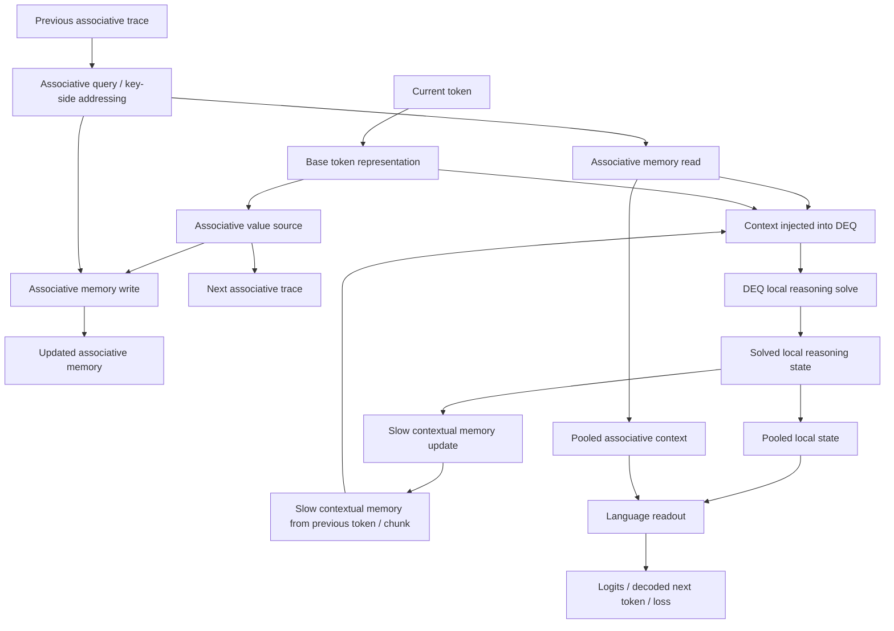
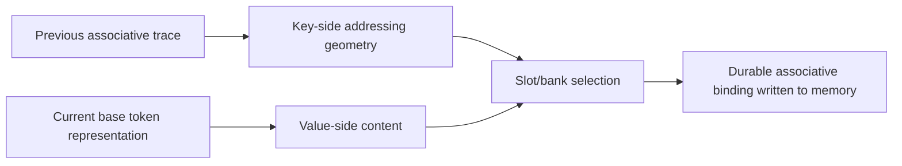
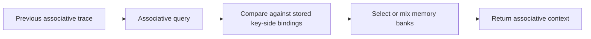
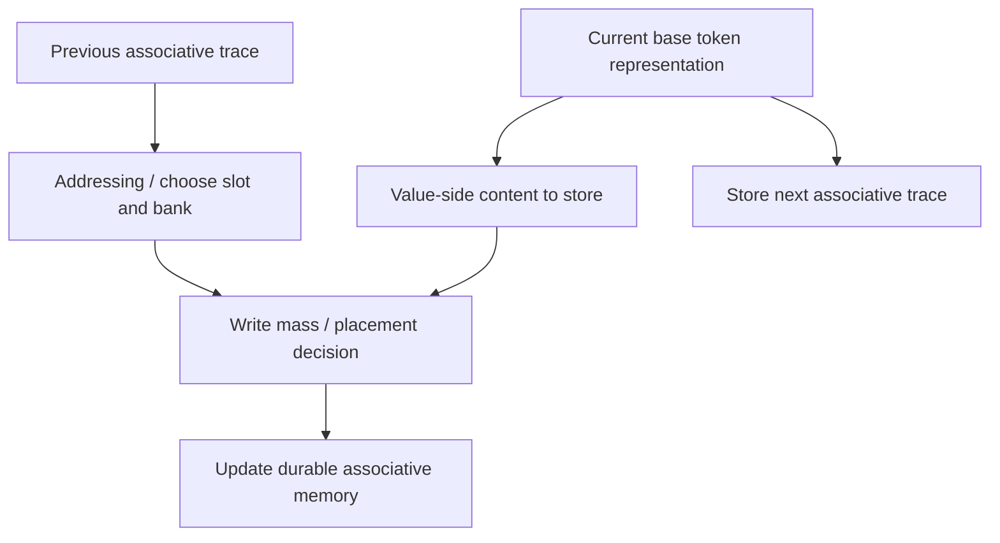
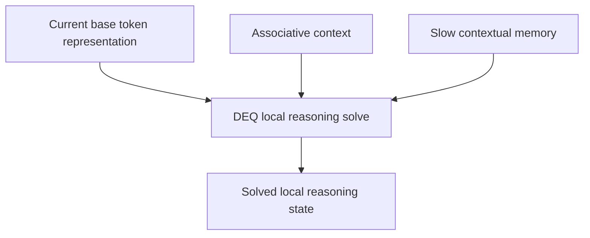
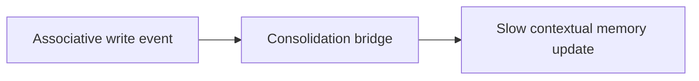
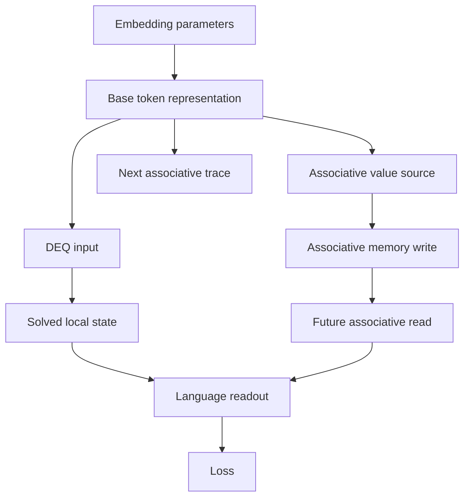
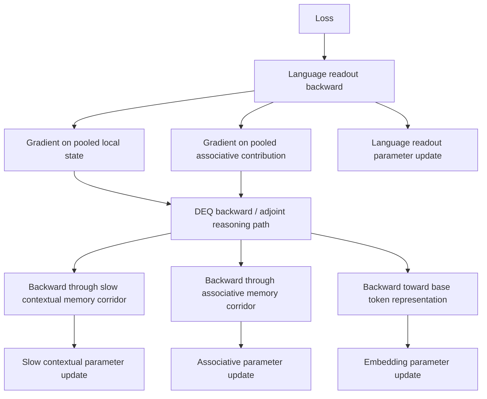
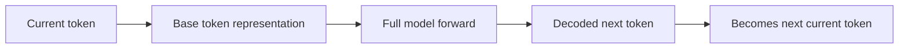

# AIDEEN Model Flow Diagram (Conceptual, Complete, Code-Faithful)

Status: conceptual architecture document grounded in the current active code path.

Goal:

- show the **actual current model flow**,
- name the **main memory types** clearly,
- show **where the associative key/value are generated**,
- show **how token carry works**,
- show **where DEQ sits**,
- and show **whether and where the memory systems connect**.

This document uses conceptual names, but it is constrained by the active implementation in:

- `/Users/sergiosolis/Programacion/AIDEEN/aideen-training-lab/src/trainer.rs`
- `/Users/sergiosolis/Programacion/AIDEEN/aideen-backbone/src/gpu_deq.rs`
- `/Users/sergiosolis/Programacion/AIDEEN/aideen-backbone/src/gpu_lm_head.rs`
- `/Users/sergiosolis/Programacion/AIDEEN/aideen-backbone/src/tokenizer.rs`
- `/Users/sergiosolis/Programacion/AIDEEN/aideen-block/src/shaders/deq_slot_attn_unified_clean.wgsl`

---

## 1. First correction: what the current model is **not**

The current model is **not** best described as:

```text
current token -> DEQ solve -> solved state h* -> associative KV memory
```

That would mean the associative memory binds on the solved DEQ state.

That is **not** the current implementation.

The current implementation is better described as:

```text
current token -> base token representation
previous token trace -> associative query/key side
current token representation -> associative value side
these memory results + slow context -> DEQ solve
DEQ solve -> local reasoning state
```

So the associative memory is currently grounded in the **token-source manifold**, while DEQ performs local reasoning on top of:

- the current token representation,
- associative read context,
- and slow contextual carry.

---

## 2. Main components of the current model

There are four major state systems and one readout system.

### 2.1 Base token representation

This is the learned embedding-space representation of the current token.

Conceptually it is:

- the first learned representation of the token,
- the main input to the whole model,
- the current source manifold for associative binding.

### 2.2 Associative memory

This is the explicit durable binding memory.

Conceptually it stores:

- key-like addressing traces,
- value-like bound content,
- usage / occupancy state.

Its job is to let future tokens retrieve discrete durable bindings.

### 2.3 Previous associative trace

This is the causal carry used by the associative system across tokens.

Conceptually it is:

- the trace of the previous token's associative source,
- the source from which the next token builds its associative query,
- the thing that provides token-to-token continuity on the associative side.

This is a different concept from DEQ local state.

### 2.4 Slow contextual memory

This is the slower contextual carry.

Conceptually it is:

- the slot-wise contextual memory available before solving the current token,
- updated after the current token is solved,
- then carried to future tokens and chunks.

This is the stateful contextual memory corridor.

### 2.5 DEQ local reasoning state

This is the local reasoning state solved for the current token.

Conceptually it is:

- the slot-structured token-local reasoning state,
- produced by the DEQ solve,
- influenced by token input, associative read, and slow contextual carry,
- then pooled and sent to the language readout.

### 2.6 Language readout

This is the LM head / text readout.

Conceptually it consumes:

- pooled local reasoning state,
- pooled associative read context,

and produces:

- logits,
- decoded token decisions,
- and training loss.

---

## 3. Full forward path, conceptually

This is the best single-picture summary of the current forward path.



This picture answers the main structural questions:

- **DEQ is explicit**: it is the local reasoning solve.
- **Memory types are explicit**:
  - associative memory,
  - previous associative trace,
  - slow contextual memory.
- **carry is explicit**:
  - previous associative trace carries token-to-token on the associative side,
  - slow contextual memory carries token-to-token and chunk-to-chunk on the contextual side.

---

## 4. The three kinds of carry in the current model

This is one of the most important clarifications.

The current model has **three distinct kinds of temporal continuity**.

## 4.1 Carry type A: previous associative trace

This is the token-to-token carry used by associative memory.

It exists so that token `t+1` can query associative memory using a trace of what token `t` contributed.

Conceptually:

```text
current token source -> stored as next associative trace -> used by next token query
```

This is a **causal addressing carry**.

## 4.2 Carry type B: slow contextual memory

This is the token/chunk carry used for contextual state.

It exists so that future tokens can be influenced by contextual traces produced by previous solved states.

Conceptually:

```text
previous contextual memory -> enters DEQ solve -> DEQ solved state -> updated contextual memory
```

This is a **contextual state carry**.

## 4.3 Carry type C: autoregressive token carry

During generation, the newly chosen token becomes the next current token.

Conceptually:

```text
decoded token_t -> becomes current token_{t+1}
```

This is the ordinary autoregressive language carry.

So the model is not carrying only one thing through time. It carries:

- token identity through decoding,
- associative trace through the associative path,
- contextual state through the slower memory path.

---

## 5. Where the associative KV are generated

This was one of the key points you asked for.

The current associative memory has two conceptual sides:

- **key/query-side geometry**
- **value-side content**

The crucial current implementation fact is:

- the key/query side is tied to the **previous associative trace**,
- the value side is tied to the **current base token representation**.

So conceptually:



This means:

- the current model does **not** create associative KV from solved DEQ state,
- it creates them from the token-source manifold and its previous causal trace.

More concretely in conceptual language:

- **associative key-side generation**: comes from the previous token-side associative trace
- **associative value-side generation**: comes from the current token representation

That is the correct high-level answer.

---

## 6. Associative read and associative write as separate subcircuits

## 6.1 Associative read

Associative read is the process by which the current token asks:

- which previous durable binding is relevant?

Conceptually:



That associative context then influences:

- the DEQ local solve,
- and the language readout.

## 6.2 Associative write

Associative write is the process by which the current token creates or updates a durable binding.

Conceptually:



This makes the temporal logic explicit:

- previous trace helps decide **where** to write,
- current token representation determines **what** gets written,
- current token representation also becomes the **trace** for the next token.

---

## 7. Where DEQ really sits

The DEQ should be pictured as the **local reasoning integrator**, not as the source of associative KV.

Conceptually it receives:

- the current base token representation,
- associative context read from durable memory,
- slow contextual memory carried from the past.

Then it solves for the current local state.



That solved local reasoning state is then used for:

- pooled state for language readout,
- slow-context update.

This is why DEQ is central, but also why it should not be confused with associative memory.

---

## 8. Do the memory systems connect to each other?

Yes, but not in the simplest possible way.

We should distinguish **direct logical roles** from **bridge interactions**.

## 8.1 Direct logical roles

- associative memory: discrete durable binding system
- slow contextual memory: carried contextual state system

At the conceptual role level, these are distinct systems.

## 8.2 Where they meet

They meet in two places:

### Meeting point 1: both feed DEQ

Both memory systems influence the current DEQ solve.

So they are coupled through the current token's reasoning process.

### Meeting point 2: write/consolidation bridge

In the current implementation, the associative write event also influences the slower contextual update corridor.

Conceptually, this means:

- when an associative write is important enough,
- part of that event also contributes to the slower contextual carry.

That is not the same as saying the two memories are identical.
It means there is a **bridge of consolidation** between them.

Conceptual picture:



So the correct answer is:

- yes, the memories do connect,
- but they connect through controlled interaction,
- not because they are the same subsystem.

---

## 9. Where embeddings connect to the rest of the flow

The embedding parameters connect at the **origin** of the whole architecture.

But because the current associative memory is grounded in the token-source manifold, embedding updates affect much more than just the first input layer.

Conceptually:



So embeddings currently shape:

- immediate reasoning input,
- associative write geometry,
- future associative query quality,
- and final language behavior.

This is why embedding stability and correctness matter so much.

---

## 10. Full training backward path

Now the backward path.

The loss is produced at the language readout, but the training signal then flows back into the whole coupled system.

Conceptually:



The main idea is:

- the model is not trained as separate independent modules,
- it is trained as a coupled reasoning-memory-readout system.

---

## 11. Generation-time carry

During autoregressive generation, the model also has to carry the newly produced token itself.

So generation has this additional outer loop:



At the same time, each step also updates:

- the previous associative trace,
- the slow contextual memory.

So generation is carrying **three things at once**:

1. the next token identity,
2. the next associative trace,
3. the next slow contextual state.

---

## 12. Best complete mental model of the current architecture

The safest current conceptual summary is this:

```text
The embedding-defined token-source manifold is the active base space.
Associative memory binds on that base space using previous-token trace for addressing and current-token source for value content.
Slow contextual memory carries slot-wise context across time.
DEQ integrates current token input, associative context, and slow contextual carry into a solved local reasoning state.
Language readout consumes both pooled solved state and pooled associative context.
Backward re-enters the reasoning and memory corridors, and embedding updates affect the whole system because they define the base token manifold.
```

That is the most complete high-level description of the current active model.
